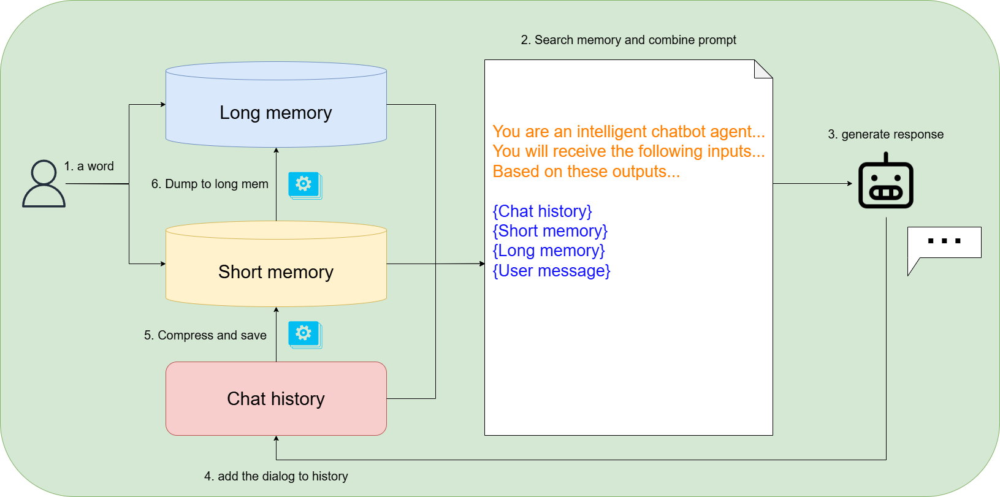
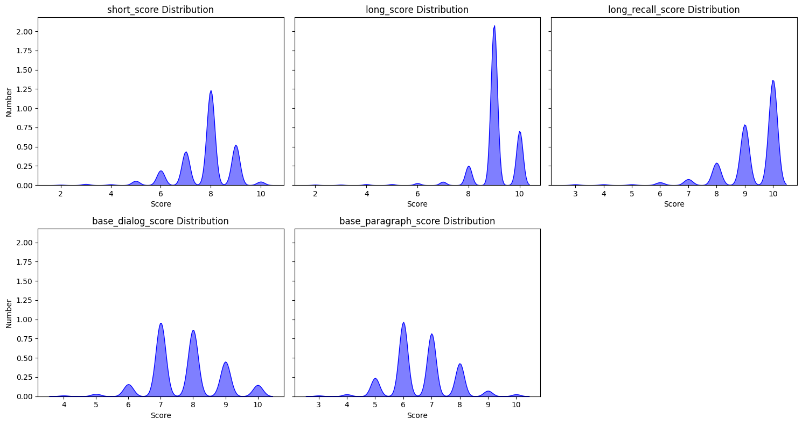

# **MemoRA : Modular Memory Retrieval Architecture for LLM systems**

## **Introduction**
MemoRA is a research project focused on simulating memory functionality in Large Language Models (LLMs) using an external modular retrieval architecture. The goal is to enhance the coherence and stability of conversations by integrating knowledge retrieval seamlessly into LLM interactions.

Key highlights of MemoRA:
- Implements memory simulation via retrieval-augmented generation (RAG).
- Modular design for easy integration and customization.
- Evaluates conversational performance in terms of fluency and stability.

## **Features**
- **Dynamic Memory Integration**: Interaction with external knowledge bases.
- **Scalable Architecture**: Supports various retrieval mechanisms.
- **Memory Types**: MemoRA uses short and long memory to store information. Short memory retains session-specific data, while long memory preserves more permanent, long-term knowledge.


## **Installation**
To get started with MemoRA, follow these steps:

```bash
# Clone the repository
git clone https://github.com/username/memoRA.git

# Navigate to the project directory
cd MemoRA

# Install dependencies
pip install -r requirements.txt
```

## **Usage**
Here is an example of how to use MemoRA in your project:

```python
from component import MemoRA

# Initialize the memory module
agent = MemoRA()

# Start chat
agent.run()
```

## **Evaluation**

Experimental results indicate that the effectiveness of memories stored in MemoRA outperforms traditional RAG methods for both types of memory in MemoRA.
